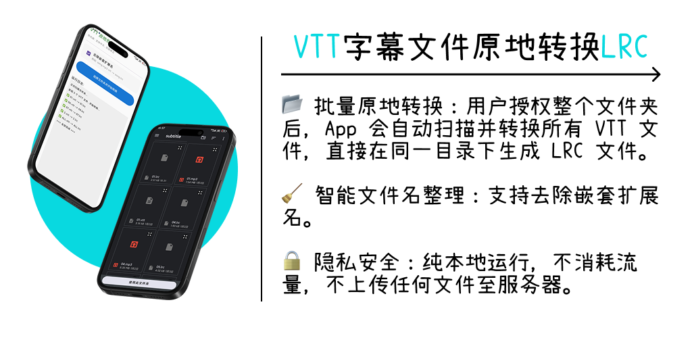

  

   

  # VTT to LRC Converter for Android

  **简单 • 高效 • 隐私安全**
  
  

    专为 Android 设计的 WebVTT (.vtt) 转 LRC (.lrc) 歌词工具。 
    不支持联网，本地极速转换，完美还原时间轴。
  

  
  
  
    
  

---

## ✨ 功能特点 (Features)

*   **📂 批量原地转换**
    *   利用 Android SAF (Storage Access Framework) 机制，授权整个文件夹后，自动扫描并批量转换。
    *   直接在**同一目录**下生成 LRC 文件，无需繁琐导入导出。

*   **⚡ 极速处理**
    *   基于 Kotlin 协程开发，文件读写与正则解析在后台线程瞬间完成。
    *   轻松处理数千个字幕文件。

*   **🧹 智能文件名清洗**
    *   支持去除嵌套扩展名，保持文件名整洁。
    *   示例：`song.mp3.vtt` -> `song.lrc` (而非 `song.mp3.lrc`)。

*   **🔒 零隐私风险**
    *   纯本地运行，**无网络权限**，不上传任何文件。

*   **📝 完美编码支持**
    *   强制使用 UTF-8 编码读写，完美支持中文、日文及特殊符号，彻底告别乱码。

*   **🛠️ 高鲁棒性**
    *   采用双侧锚定的正则匹配算法，精确提取时间轴与歌词文本。

## 🚀 使用方法 (Usage)

1.  **准备文件**
    *   将 `.vtt` 字幕文件保存在手机任意文件夹（推荐 Download 或 Movies）。

2.  **设置选项**
    *   打开 App，根据需要勾选或取消“去除嵌套扩展名 (Clean Extension)”。

3.  **授权并开始**
    *   点击 **“选择文件夹并开始转换”**。
    *   在系统文件选择器中，找到存放 VTT 的文件夹。
    *   点击底部 **“使用此文件夹” (Use this folder)** -> **“允许” (Allow)**。

4.  **完成**
    *   转换进度实时显示，完成后 `.lrc` 文件将直接生成在原文件夹中。

## ⚠️ 注意事项 (Important Notes)

> [!WARNING]
> **关于数据覆盖 (Overwrite Warning)**
>
> 本应用采用**原地写入**策略：
> 1. 如果检测到同名 `.lrc` 文件，程序将**直接覆盖旧文件**。
> 2. 此操作不可撤销。
> 3. **建议**：在批量操作前，请确保目标文件夹中没有需要保留的同名 `.lrc` 文件，或已做好备份。

## 🤖 开发幕后 (Development Story)

本项目是一个 **AI 协作实验**，代码完全由 LLM 生成与审查：

*   **👨‍💻 主程 (Architect & Coder): Google Gemini**
    *   负责项目架构设计、Android SAF 权限逻辑、Kotlin 核心代码及 Jetpack Compose UI 构建。
    *   提供了基于 Android 原生 API 的高性能实现方案。

*   **🕵️ 质检与调试 (QA & Debugger): ChatGPT**
    *   负责代码审查 (Code Review)，指出了原始实现中的潜在 Bug（如 UTF-8 编码、权限持久化、正则鲁棒性）。
    *   扮演“对抗者”角色，模拟极端边界情况，迫使代码方案进行了三轮迭代优化。

## 🔗 致谢与协议 (Credits & License)

核心处理流程参考了优秀的开源项目：
*   **[vtt-to-lrc-converter](https://github.com/meng0224/vtt-to-lrc-converter)** by @meng0224

**License**
*   This project is provided for **non-commercial use only**.
*   本项目仅供非商业用途使用。
